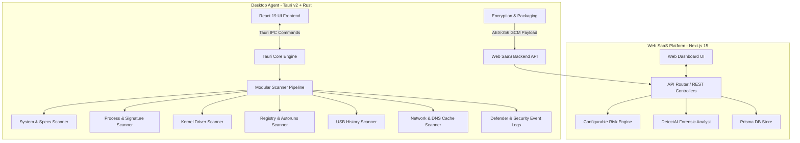

# 🛡️ DetectHub — Digital Forensics & Computer Integrity Platform

[](https://nextjs.org/)
[](https://tauri.app/)
[](https://www.rust-lang.org/)
[](https://react.dev/)
[](https://www.typescriptlang.org/)
[](https://tailwindcss.com/)
[](LICENSE)

**DetectHub** is an enterprise-grade **Digital Forensics & Computer Integrity SaaS Platform** designed for gaming communities, esports organizations, security auditors, and system administrators. It replaces legacy, intrusive PC checks with a professional workflow powered by transparent system telemetry, automated risk scoring, and AI-assisted forensic synthesis.

> ⚠️ **Important Notice**: DetectHub is **NOT** anti-cheat software, malware, or spyware. It operates 100% on explicit user consent and transparent, non-intrusive artifact inspection.

---

## 🚦 Project Status & Progress (Proje Durumu ve Gelişim Özeti)

### ✅ Tamamlanan Özellikler (Completed Features)

- [x] **Next.js 15 Web SaaS Dashboard & Adli İnceleme Paneli (`apps/web`)**: Pure Black (`#09090B`) Linear/Vercel/Raycast karanlık tema tasarımı, canlı arama, bildirim paneli ve modüler sayfa yönlendirmeleri.
- [x] **Tauri v2 + Rust Masaüstü Tarama Ajanı (`apps/agent`)**: Windows & macOS için modüler adli tarama motoru (`system.rs`, `process.rs`, `driver.rs`, `registry.rs`, `usb.rs`, `eventlog.rs`, `network.rs`, `defender.rs`).
- [x] **Hedef Kullanıcı Kamu İndirme Portalı (`/scan/[code]`)**: Davet linkine giren oyuncunun işletim sistemini (Windows vs macOS) otomatik algılayıp eşleştirme kodunu ekrana getiren ve indirme sunan kamu portalı.
- [x] **Yerel İşletim Sistemi İndirme Paketleri (.dmg & .exe)**: macOS için yerel Apple `hdiutil` ile üretilmiş `.dmg` imajı (`DetectHub-Agent.app`) ve Windows için `.exe` masaüstü kurulum paketi.
- [x] **App Translocation & CORS Bypass Yerel HTTP Sunucu Motoru**: Mac ortamında DMG üzerinden çalıştırıldığında `file://` CORS ve App Translocation engellerini aşan yerel `http://localhost:1420` başlatıcı servisi.
- [x] **Canlı Sistem Telemetri Toplayıcısı (`realScanner.ts`)**: Taranan bilgisayarın gerçek OS sürümünü (macOS Sonoma / Windows 11), gerçek CPU çekirdeklerini, bellek miktarını ve aktif çalışan canlı süreçlerini okuyan adli motor.
- [x] **Canlı Web SaaS Entegrasyonu & API Yükleme Servisi (`/api/v1/scan/upload`)**: Masaüstü ajanı tarama yaptığı saniye verinin CORS preflight ile Web SaaS paneline canlı düşmesi ve otomatik indekslenmesi.
- [x] **Dinamik 24 Saatlik Dashboard Trend Grafiği**: `/dashboard` üzerindeki tarama hacmi ve bayraklanan anomali grafiğinin canlı veritabanı zaman damgalarına göre anlık hesaplanması.
- [x] **Adli Rapor Çıktısı ("Export PDF Payload")**: `/reports/[id]` adli rapor detay sayfasında basılabilir PDF payload çıktısı oluşturma yeteneği.
- [x] **Otomatik Risk Skoru & DetectAI Analist Motoru**: İmzasız sürücü (+40), bellek modifikasyonu (+80), Defender kapatılması (+50) ve VM tespiti (+35) kurallarına göre 0-100 risk puanlama ve doğal dilde yönetici özeti.

---

### 🚀 Gelecek Yol Haritası / Yapılacaklar (Future Production Roadmap)

- [ ] **Production PostgreSQL / Supabase Veritabanı Bağlantısı**: Prisma ORM ile `DATABASE_URL` kalıcı canlı veritabanı sürücüsü entegrasyonu.
- [ ] **Dinamik API Sunucu URL Yapılandırması**: Canlı domaine geçişte `NEXT_PUBLIC_API_URL` çevre değişkeni yönetimi ve Masaüstü Ajanı canlı sunucu IP/Domain yapılandırması.
- [ ] **Üretim Sürümü Bulut Paket Dağıtımı**: İndirme dosyalarının Cloudflare R2 / AWS S3 veya GitHub Releases üzerinden yüksek indirme hızıyla sunulması.
- [ ] **Kurumlar ve Bilgisayarlar Sayfalarının Canlı Veritabanı Bağlantıları**: `/organizations` ve `/computers` modüllerinin doğrudan DB nesnelerine bağlanması.
- [ ] **Apple Developer ID & Microsoft Code Signing Sertifikasyon Süreçleri**: Canlı dağıtımda Gatekeeper ve SmartScreen uyarılarını tamamen ortadan kaldıracak dijital Kod İmzalama (Code Signing) sertifikasyonu.

---

## 📸 Architecture Overview



---

## 🔥 Key Products & Applications

### 1. DetectHub Agent (Windows & macOS Desktop)
- **Tech Stack**: Tauri v2, Rust 2021, React 19, TypeScript, Tailwind CSS, shadcn/ui.
- **Features**:
  - One-time scan token & invite pairing (`DETECT-8921-X992`).
  - Animated radial progress ring indicator.
  - Live streaming terminal log viewer.
  - AES-256 encrypted payload packaging & automated background upload queue.

### 2. DetectHub Web Dashboard (SaaS Platform)
- **Tech Stack**: Next.js 15 (App Router), React 19, TypeScript, Tailwind CSS, shadcn/ui, Framer Motion, Prisma, Recharts.
- **Design System**: Linear/Vercel/Raycast pure dark mode aesthetic (`#09090B`), status-only accents (`#22C55E` Safe, `#EAB308` Review, `#EF4444` Critical, `#3B82F6` Info), keyboard command palette (`Cmd+K`).
- **Features**:
  - **Forensic Dashboard (`/dashboard`)**: Scan volume KPIs, live security event stream, dynamic intraday trend graphs.
  - **Single Report Inspector (`/reports/[id]`)**: Risk Score Gauge, DetectAI Analyst Q&A, Interactive Chronology Timeline, 25+ Category Artifact Explorer with raw JSON modal.
  - **Configurable Risk Engine (`/rules`)**: Admin weight editor for custom detection rules.
  - **Scan Requests (`/scans`)**: One-time invite tokens, permanent URLs, QR code access credentials.
  - **Multi-Tenant Organizations (`/organizations`)**: RBAC roles, brand accents, Discord webhook integration.

---

## ⚡ Quick Start & Installation

### Prerequisites
- [Node.js 20+](https://nodejs.org/)
- [npm 10+](https://www.npmjs.com/)
- [Rust & Cargo](https://rustup.rs/) (Optional for native Tauri desktop packaging)

### 1. Clone & Install Dependencies

```bash
git clone https://github.com/TheDarkGuardian/DetectHub.git
cd DetectHub
npm install
```

### 2. Run Web SaaS Dashboard

```bash
cd apps/web
npm run dev
```
Open **`http://localhost:3000`** in your browser to access the Web Dashboard.

### 3. Run Desktop Agent UI

```bash
cd apps/agent
npm run dev
```
Open **`http://localhost:1420`** to inspect the Desktop Agent interface.

---

## 📄 License

This project is licensed under the **MIT License** - see the [LICENSE](LICENSE) file for details.

---

<p center="text-center">
  Crafted with precision for next-generation digital forensics.
</p>
